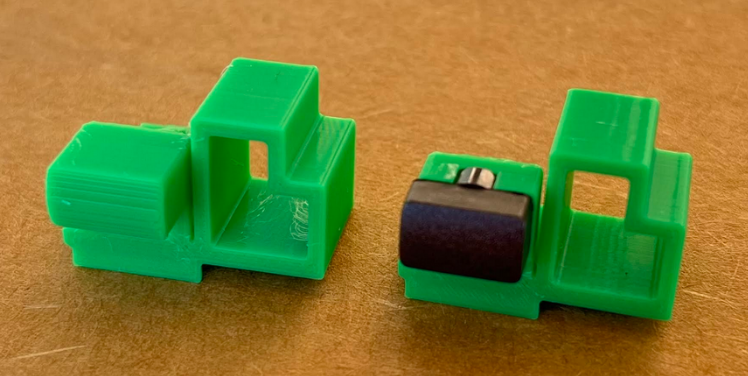
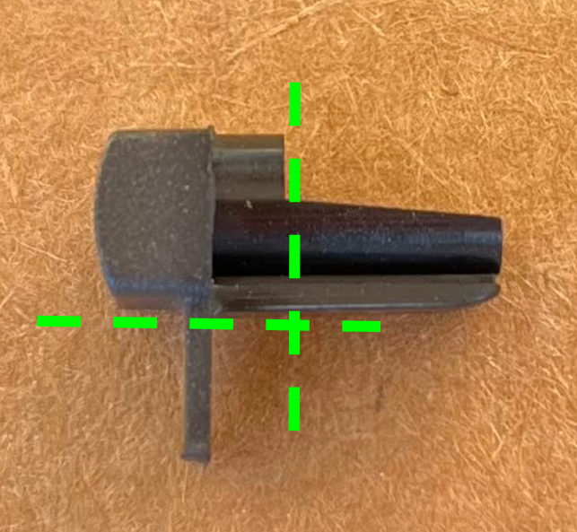

# JVC-buttons

This 3D-printable part is intended to replace the broken power button on JVC TM-H1950 series video monitors. It may also work for other JVC monitors, but I haven’t tested any. 

There are two versions of the replacement part: one that allows you to reuse the original “button cap” to preserve the monitor’s original appearance, and one that has an integrated button cap for full part replacement. 

The original SketchUp design files are also included if you want to make any edits. Note that each single part is divided into multiple parts to make modifications easier. 

### Printing and part assembly

- I printed on a Bambu P1P with Bambu Basic PLA. The best orientation I've found is with the face of the button pointing upward. [Bambu print settings.](jvc_btn_bambu_preset.json)

- If you are using the original button cap, it will have to be trimmed down to fit. Using a Dremel or other cutting tool, make the two cuts shown here:

- Snap the button cap onto the part. Glue is optional – I don’t use it myself, but if you’re going to, do confirm that everything (button+control board+bezel) is going to fit together properly before gluing something you may regret. 

### Recommended installation instructions

- NOTE: This installation will require discharging the tube. This is a **critical** for safety, and if you don’t know what this means, you’ve got a lot of background reading to do before opening up a CRT. Also, these plastic parts are old and brittle, so go slowly. 

- Unplug monitor, remove the case, including the black rear panel, and discharge the tube. 

- Next, you have to get the tube and bezel separated from the rest of the monitor. Fully disconnect the tube from the main circuit boards, including the anode cap (DISCHARGED!), the neck board, and a few other wires.[^1] Carefully remove the entire circuit board assembly, which sits on a black plastic tray, by slightly lifting and sliding the tray toward the back. The control board (with all of the buttons) should slide out with it. 

- The control board is on its own plastic tray which is clipped into the main one. Disconnect the ribbon cable from the main board and separate the trays. 

- The remaining assembly should only be the tube, bezel, and base plate. Lay it screen-down on a padded surface like a mattress. Roll up a towel and put it under the bottom half of the screen to prop up the button panel. 

- Fish out the power button and any other broken bits from inside of the bezel, which could interfere with reseating the control board. I’m assuming that your power button broke the same way mine did, which is that the button’s flexible plastic hinge fully broke off of the bezel; if it didn’t, you may need to trim off its remains. 

- Drop the new part in, making sure that the button cap passes through the hole in the panel. Follow this by sliding the control board back in. The new button piece is designed to fit tightly, so there might be some wiggling in order to get everything back together, but don’t put a lot of force on anything. If it feels like the control board is getting hung up somewhere, it could be the board’s plastic LED mounts bumping into the bezel. 

- With the control board in place, test each button to make sure it clicks properly. If everything works, reassemble!

[^1]: For my monitor, the required disconnections are: 1) the anode cap, 2) the neck board, 3) black wire connected to braided ground cable stretched across the tube (disconnect at neck board), 3) orange and gray wires to (vertical) signal board, 4) black and white wires to signal board, 5) black and white wires to main board, 6) heavy, 4-color wires connected to main board. 
